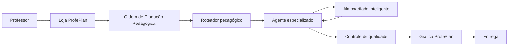

# Visão Geral da Arquitetura

## 1. Objetivo

A arquitetura do ProfePlan Knowledge Factory deve permitir que o professor solicite um produto pedagógico sem precisar conhecer os agentes, bancos ou fluxos internos.

## 2. Fluxo principal

## 3. Camadas

### 3.1 Experiência e catálogo

A Loja ProfePlan coleta o pedido, contexto da turma, componente, ano, currículo e formatos de entrega.

### 3.2 Orquestração

A Ordem de Produção Pedagógica representa o pedido em formato estruturado. O roteador seleciona o agente principal e os apoios necessários.

### 3.3 Conhecimento

O Almoxarifado mantém componentes pedagógicos estruturados, metadados, relações curriculares, procedência, licença e embeddings.

### 3.4 Produção

O agente principal combina componentes e contexto para criar um produto novo. Agentes auxiliares fornecem contribuições limitadas e específicas.

### 3.5 Qualidade

Validadores verificam coerência pedagógica, currículo, inclusão, autoria, segurança e viabilidade.

### 3.6 Acabamento

A Gráfica transforma conteúdo aprovado em PDF, documento editável, apresentação ou outros formatos.

## 4. Princípios técnicos

- infraestrutura comum com perfis especializados;
- privilégios mínimos de conhecimento;
- filtros estruturados antes da busca semântica;
- currículos estaduais carregados sob demanda;
- recuperação limitada por orçamento;
- rastreabilidade entre produto e fontes;
- separação entre conhecimento original, componente destilado e produto gerado;
- versionamento de agentes, currículos e componentes;
- observabilidade de custo, latência e qualidade.

## 5. Fronteiras

O agente especializado não deve:

- carregar todo o acervo;
- consultar outros anos sem justificativa;
- misturar MG e RS automaticamente;
- reproduzir atividades protegidas;
- diagramar o produto final;
- tratar embedding como fonte de verdade.

## 6. Decisões técnicas ainda abertas

Esta visão não define definitivamente modelos, provedores, dimensões de embedding, mecanismo de reranqueamento ou cache. Essas escolhas dependerão de testes do piloto.
