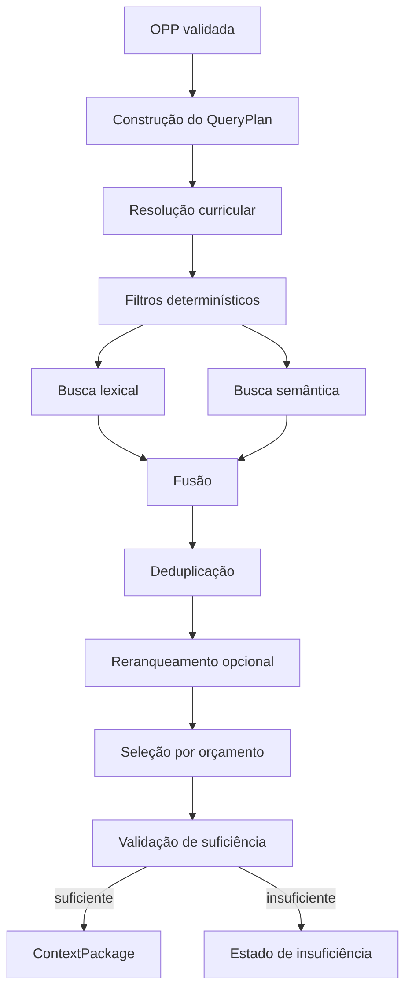

# Arquitetura de Recuperação Híbrida

## Status

Proposta do Marco 003. Define o pipeline e as garantias. Modelo de embedding, dimensão, índice, reranker e cache permanecem dependentes de experimentos.

## Objetivos

- eliminar mistura de disciplina, ano, Estado e licença;
- recuperar poucos componentes pedagógicos relevantes;
- reduzir tokens enviados ao gerador;
- preservar rastreabilidade;
- reconhecer insuficiência;
- comparar custo e latência com qualidade;
- operar com fallback controlado.

## Pipeline

## 1. QueryPlan

Objeto gerado antes da consulta:

- `oppId`;
- `subject = philosophy`;
- `stage = high_school`;
- `grade = 2`;
- `state = MG`;
- `curriculumPackageId`;
- `productType`;
- `theme`;
- `requiredComponentTypes`;
- `optionalComponentTypes`;
- `licenseEligibility`;
- `statusEligibility = approved`;
- `maxCandidatesPerChannel`;
- `maxFinalComponents = 8`;
- `maxContextTokens`;
- `minimumEvidenceRules`;
- `createdAt`;
- `plannerVersion`.

O QueryPlan é auditável e não pode ser substituído por uma consulta livre do modelo.

## 2. Filtros determinísticos

Aplicados antes da busca lexical e semântica:

- componente curricular;
- etapa;
- ano;
- pacote estadual;
- status da versão;
- elegibilidade de licença;
- vigência;
- finalidade do componente;
- tipo do produto;
- política de acesso do agente;
- tenant quando houver conteúdo privado.

Regra crítica: similaridade nunca concede permissão. Candidato fora do escopo não é pontuado; é inelegível.

## 3. Busca lexical

Candidata a usar recursos nativos do PostgreSQL em português.

Funções:

- termos exatos;
- códigos curriculares;
- nomes de autores e conceitos;
- correspondências raras;
- fallback quando embedding estiver indisponível.

Campos pesquisáveis devem ser explícitos:

- título;
- `searchableText`;
- temas;
- palavras-chave;
- conceitos relacionados;
- erros frequentes;
- perguntas essenciais.

Não pesquisar texto bruto protegido no fluxo produtivo padrão.

## 4. Busca semântica

Opera sobre embeddings de versões aprovadas.

Regras:

- o vetor pertence à versão do componente;
- provider, modelo e dimensão são registrados;
- a consulta usa a mesma configuração do índice avaliado;
- múltiplas configurações só coexistem sob experimento controlado;
- falha de embedding não transforma conteúdo inelegível em elegível;
- nenhum dado pessoal entra no texto de embedding.

## 5. Fusão

A estratégia inicial preferida para experimento é uma fusão independente de escala, como Reciprocal Rank Fusion, comparada com:

- lexical isolada;
- semântica isolada;
- soma normalizada;
- regras de peso por tipo de consulta.

A escolha final dependerá das métricas. A fusão deve preservar:

- posição em cada canal;
- score original;
- score de fusão;
- motivo de inclusão;
- versão do algoritmo.

## 6. Deduplicação de candidatos

Antes do reranking:

- remover a mesma versão retornada por dois canais;
- preferir versão corrente aprovada;
- não incluir simultaneamente componentes marcados como duplicados;
- limitar excesso de uma mesma fonte ou conceito;
- preservar divergências filosóficas intencionais quando o QueryPlan pedir contraste.

## 7. Reranqueamento

Não é requisito automático do primeiro incremento.

Candidatos experimentais:

- sem reranker;
- regras determinísticas;
- modelo de reranking dedicado;
- LLM com contrato curto e baixa temperatura.

O reranker nunca pode:

- introduzir candidatos fora do conjunto filtrado;
- acessar fonte bloqueada;
- alterar licença ou status;
- ocultar a origem do candidato;
- ampliar o contexto além do orçamento.

## 8. Orçamento de contexto

Ordem de seleção sugerida:

1. currículo necessário;
2. conceitos centrais;
3. relações conceituais;
4. pergunta essencial ou caso;
5. estratégia metodológica;
6. avaliação;
7. inclusão.

O orçamento considera:

- máximo de componentes;
- tokens estimados;
- diversidade de tipos;
- redundância;
- cobertura curricular;
- necessidade do produto.

Exceder oito componentes exige evento e justificativa; não pode ser comportamento padrão.

## 9. Suficiência

A suficiência não depende somente do maior score.

Critérios mínimos propostos:

- ao menos um componente conceitual aprovado;
- vínculo curricular aplicável quando o produto exigir alinhamento;
- evidência autorizada;
- cobertura do tema principal;
- ausência de conflito crítico não resolvido;
- score/posição acima do limite calibrado;
- contexto dentro do orçamento.

Estados:

- `sufficient`;
- `insufficient_no_candidates`;
- `insufficient_low_relevance`;
- `insufficient_curriculum_gap`;
- `insufficient_license_gap`;
- `review_required_conflict`.

## 10. RetrievalRun

Campos mínimos:

- `id`;
- `oppId`;
- `queryPlanSnapshot`;
- `embeddingConfigurationId`;
- `lexicalConfigurationId`;
- `fusionConfigurationId`;
- `rerankerConfigurationId`, opcional;
- filtros aplicados;
- candidatos por canal;
- candidatos excluídos e motivo;
- ranking final;
- suficiência;
- tokens estimados;
- latência por etapa;
- custo por etapa;
- versão do pipeline;
- timestamps.

## 11. Fallbacks

- vetor indisponível: busca lexical pode operar, marcando modo degradado;
- lexical sem resultado: semântica não ignora filtros;
- ambos sem resultado: insuficiência;
- reranker indisponível: utilizar ranking de fusão se configuração permitir;
- banco indisponível: falha tipada, não geração sem base;
- orçamento excedido: reduzir por regra ou retornar revisão, nunca truncar evidência silenciosamente.

## 12. Cache

Nenhum cache será escolhido antes de medir repetição, custo e risco de vazamento.

Possibilidades futuras:

- cache de embedding de consulta por hash e configuração;
- cache de QueryPlan determinístico;
- cache de resultado de retrieval para corpus e versões imutáveis;
- cache de pacote curricular.

Restrições:

- chave inclui tenant, pacote, filtros, versões e configuração;
- invalidação por mudança de componente/licença;
- conteúdo privado nunca compartilha cache entre tenants;
- cache não pode ocultar auditoria nem métricas reais do experimento.

## 13. APIs lógicas

- `buildQueryPlan(opp)`;
- `applyEligibilityFilters(queryPlan)`;
- `searchLexical(queryPlan)`;
- `searchSemantic(queryPlan, configuration)`;
- `fuseCandidates(channels, configuration)`;
- `deduplicateCandidates(candidates)`;
- `rerankCandidates(candidates, configuration)`;
- `assembleContext(candidates, budget)`;
- `assessSufficiency(context)`;
- `recordRetrievalRun(run)`.

## 14. Testes de segurança do retrieval

- hard negative de Filosofia de outro ano;
- Sociologia do 2º ano;
- currículo RS;
- fonte bloqueada semanticamente muito semelhante;
- componente superseded;
- componente sem vínculo curricular;
- conteúdo privado de outro tenant;
- duplicados;
- conflito filosófico intencional;
- consulta sem resultado;
- embedding e lexical indisponíveis.

## Decisão proposta

**ADR-020 — A recuperação usa filtros determinísticos antes dos canais lexical e semântico, com fusão auditável e suficiência explícita.**

Status: proposta, aguardando aprovação.
