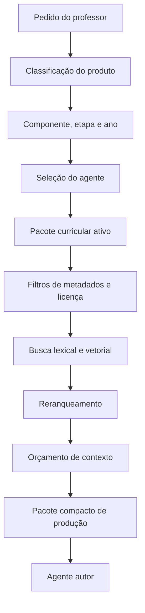

# Pipeline de Recuperação

## 1. Princípio

Primeiro restringir o território pedagógico; depois pesquisar semanticamente.

## 2. Fluxo

## 3. Filtros obrigatórios

Antes da busca vetorial:

- componente curricular;
- etapa;
- ano;
- currículo estadual ativo;
- tipo de componente;
- finalidade;
- status de validação;
- permissão de geração;
- idioma;
- vigência, quando aplicável.

## 4. Recuperação híbrida

A recuperação poderá combinar:

- correspondência exata de metadados;
- pesquisa textual;
- similaridade semântica;
- relações curriculares;
- reranqueamento.

A tecnologia definitiva será escolhida após testes.

## 5. Orçamento

Cada agente terá limites de:

- candidatos iniciais;
- componentes reranqueados;
- componentes enviados ao modelo;
- tokens de contexto;
- consultas auxiliares.

O orçamento inicial do Sócrates 2 ainda será calibrado. Como hipótese de teste, o pacote final poderá conter de 5 a 10 componentes altamente relevantes, sem compromisso definitivo.

## 6. Consulta interdisciplinar

O acesso a outro domínio não é automático. O Sócrates 2 deve justificar a necessidade e solicitar apenas o componente complementar indispensável.

## 7. Saída

O agente autor não recebe páginas completas nem todos os resultados. Recebe um pacote compacto contendo:

- objetivo curricular;
- conceitos prioritários;
- problemas filosóficos;
- estratégias metodológicas;
- opções avaliativas;
- orientações inclusivas;
- referências rastreáveis.

## 8. Métricas

- precisão da recuperação;
- taxa de componentes descartados;
- tokens recuperados;
- latência;
- custo;
- mistura indevida de ano ou componente;
- aderência curricular;
- avaliação humana do produto.
