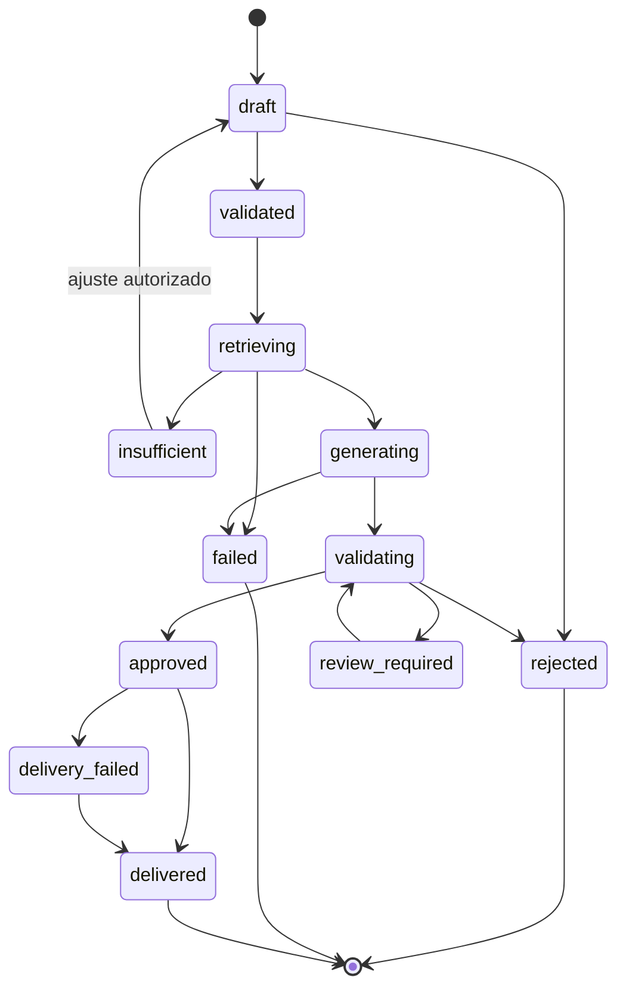

# Contrato Técnico da OPP e da Entrega

## Status

Proposta do Marco 003. Define estados, campos e invariantes; não define endpoint físico nem tabela.

# 1. Ordem de Produção Pedagógica

A OPP é o agregado central que preserva o pedido, coordena etapas e mantém a trilha de decisão.

## Campos mínimos

- `id`;
- `schemaVersion`;
- `version`;
- `tenantId`;
- `requesterId`;
- `requestId` ou chave de idempotência;
- `productType`;
- `theme`;
- `subject`;
- `educationStage`;
- `grade`;
- `curriculumState`;
- `curriculumPackageId`;
- `durationMinutes`, quando aplicável;
- `classContext`, minimizado;
- `methodologyPreferences`;
- `inclusionRequirements`;
- `status`;
- `createdAt`;
- `updatedAt`;
- `startedAt`;
- `completedAt`;
- `failureCode` e `failureSummary`, quando houver.

## Tipos de produto do MVP

- `lesson_plan`;
- `didactic_text`;
- `reflective_activity`;
- `formative_assessment`;
- `integrated_lesson_package` como Should.

## Estados

## Invariantes

- não inicia retrieval sem pacote curricular resolvido;
- não inicia geração sem context package válido;
- não recebe `approved` com gate Must falho;
- não recebe `delivered` sem contrato de entrega persistido;
- mudança de escopo após `validated` produz nova versão ou evento de alteração;
- retry não apaga a tentativa anterior;
- pedido idempotente não cria duas OPPs ativas equivalentes;
- contexto da turma não inclui dados pessoais desnecessários.

## OPPEvent

Cada mudança relevante produz evento append-only:

- `id`;
- `oppId`;
- `sequence`;
- `eventType`;
- `actorType`;
- `actorId` ou identificador técnico;
- `occurredAt`;
- `payload` minimizado;
- `correlationId`;
- `causationId`;
- `schemaVersion`.

Eventos mínimos:

- `OPP_CREATED`;
- `OPP_VALIDATED`;
- `CURRICULUM_RESOLVED`;
- `AGENT_ROUTED`;
- `RETRIEVAL_STARTED`;
- `RETRIEVAL_COMPLETED`;
- `KNOWLEDGE_INSUFFICIENT`;
- `GENERATION_STARTED`;
- `GENERATION_COMPLETED`;
- `VALIDATION_COMPLETED`;
- `PRODUCT_APPROVED`;
- `PRODUCT_REJECTED`;
- `DELIVERY_COMPLETED`;
- `DELIVERY_FAILED`.

# 2. ContextPackage

Pacote compacto fornecido ao agente gerador.

Campos:

- `id`;
- `oppId`;
- `retrievalRunId`;
- `curriculumScope`;
- `componentReferences`;
- `componentSnapshots` permitidos;
- `sourceAttributionRequirements`;
- `tokenEstimate`;
- `budgetDecision`;
- `insufficiencyStatus`;
- `assembledAt`;
- `assemblerVersion`.

Regras:

- máximo padrão de oito componentes;
- referências apontam para versões exatas;
- snapshots contêm somente campos necessários à geração;
- nenhuma página ou capítulo completo por padrão;
- componentes redundantes são removidos;
- exceder o orçamento exige justificativa auditável;
- insuficiência impede geração aprovada.

# 3. GenerationRun

Campos:

- `id`;
- `oppId`;
- `contextPackageId`;
- `agentProfileVersion`;
- `promptTemplateVersion`;
- `modelPolicyId`;
- `provider` e `model`, registrados após execução;
- `inputTokens`;
- `outputTokens`;
- `estimatedCost`;
- `latencyMs`;
- `attempt`;
- `status`;
- `rawOutputRef` protegido;
- `structuredOutput` validado;
- `startedAt` e `completedAt`;
- `errorCode`.

O contrato registra o modelo utilizado, mas não obriga um modelo específico no domínio.

# 4. DeliveryContract

Envelope comum de todos os produtos.

Campos mínimos:

- `id`;
- `schemaVersion`;
- `oppId`;
- `productType`;
- `title`;
- `teacherFacingContent`;
- `studentFacingContent`, quando aplicável;
- `learningObjectives`;
- `curriculumReferences`;
- `knowledgeReferences`;
- `sourceAttributions`, quando exigidas;
- `methodology`;
- `durationMinutes`, quando aplicável;
- `inclusionNotes`;
- `assessmentCriteria`, quando aplicável;
- `validationSummary`;
- `generatedAt`;
- `deliveryStatus`.

## Contratos por produto

### LessonPlanPayload

- objetivos;
- tempo total;
- etapas com duração;
- conteúdos e conceitos;
- metodologia;
- recursos;
- atividade;
- avaliação formativa;
- orientações inclusivas;
- continuidade opcional.

### DidacticTextPayload

- título;
- introdução;
- desenvolvimento em seções;
- conceitos-chave;
- exemplos;
- questões de reflexão opcionais;
- nível de leitura;
- notas ao professor separadas.

### ReflectiveActivityPayload

- objetivo;
- situação ou estímulo;
- instruções;
- organização individual/grupo;
- tempo;
- perguntas ou etapas;
- produto esperado;
- critérios de acompanhamento;
- alternativas inclusivas.

### FormativeAssessmentPayload

- objetivo avaliado;
- itens;
- tipo e dificuldade;
- critérios de resposta;
- gabarito ou referência de correção separada;
- evidência curricular;
- orientações de devolutiva.

### IntegratedLessonPackagePayload

- referências para as quatro peças;
- objetivo central compartilhado;
- validação de coerência interna;
- duração global;
- dependências entre peças.

## ValidationSummary

Não substitui registros internos. Expõe somente:

- status geral;
- gates executados;
- versão dos validadores;
- avisos permitidos ao professor;
- identificador de rastreabilidade.

## Entrega simples do MVP

Formatos permitidos inicialmente:

- JSON estruturado interno;
- renderização web existente;
- texto organizado para copiar/editar;
- documento simples somente se a infraestrutura atual já suportar sem ampliar escopo.

Fora do MVP:

- PDF sofisticado;
- PPTX sofisticado;
- infográficos automáticos;
- seleção avançada de tema visual;
- montagem editorial industrial.

# 5. APIs lógicas

- `createProductionOrder(request)`;
- `validateProductionOrder(opp)`;
- `resolveAgent(opp)`;
- `retrieveContext(opp)`;
- `generateProduct(opp, contextPackage)`;
- `validateProduct(opp, candidate)`;
- `approveOrRejectProduct(validation)`;
- `deliverProduct(opp)`;
- `getProductionOrderStatus(id)`.

A forma REST, RPC ou função interna será definida conforme o repositório canônico. O contrato não deve ser acoplado prematuramente ao transporte.

# 6. Idempotência e concorrência

- criação usa chave idempotente por solicitante e pedido;
- transições usam controle otimista ou mecanismo equivalente;
- apenas uma execução principal pode avançar a OPP por etapa;
- jobs repetidos verificam estado antes de agir;
- entrega pode ser repetida sem duplicar produto;
- versão do contexto e do produto não muda durante validação.

# 7. Testes obrigatórios

- OPP válida;
- campo obrigatório ausente;
- combinação de escopo inválida;
- pedido fora do Sócrates 2;
- tentativa de gerar antes do retrieval;
- insuficiência de contexto;
- retry de geração;
- falha de gate Must;
- entrega idempotente;
- reconstrução completa da linha do tempo;
- separação entre conteúdo do professor e estudante;
- produto histórico preserva todas as versões utilizadas.
