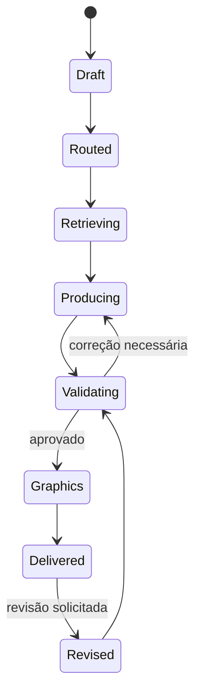

# Ordem de Produção Pedagógica — OPP

## 1. Finalidade

A OPP é o contrato estruturado entre a Loja ProfePlan e as fábricas de produção. Ela registra o que foi solicitado, o contexto, o agente responsável, os currículos, os entregáveis e as validações necessárias.

## 2. Campos iniciais

- identificador da ordem;
- professor e contexto organizacional;
- componente;
- etapa;
- ano;
- currículo estadual ativo;
- tipo de produto;
- tema;
- duração;
- objetivos;
- metodologia desejada;
- características da turma;
- necessidades de inclusão;
- entregáveis;
- agente principal;
- agentes auxiliares autorizados;
- orçamento de recuperação;
- controles de qualidade;
- formatos de saída.

## 3. Exemplo

```json
{
  "order_id": "opp-example-001",
  "component": "Filosofia",
  "stage": "Ensino Médio",
  "grade": "2",
  "curriculum_package": "MG",
  "product_type": "lesson_plan",
  "theme": "Liberdade e responsabilidade",
  "duration_minutes": 50,
  "primary_agent": "socrates-2",
  "deliverables": ["teacher_plan", "student_activity"],
  "quality_gates": ["curriculum", "pedagogical", "copyright", "inclusion"]
}
```

## 4. Estados da ordem



## 5. Regra de integração

O professor recebe um produto unificado. A OPP pode registrar múltiplos agentes internos, mas a responsabilidade autoral e de integração permanece com o agente principal.

## 6. Auditoria

A OPP deve permitir reconstruir:

- qual contexto foi utilizado;
- qual agente produziu;
- quais componentes foram recuperados;
- qual currículo estava ativo;
- quais validações foram executadas;
- qual versão do produto foi entregue.
