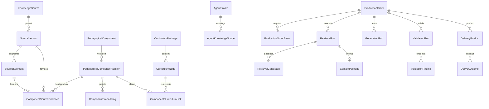

# Modelo Lógico de Dados do MVP

## Status

Proposta do Marco 003. Não é schema SQL, Prisma ou migration. Define entidades, relações, ownership e invariantes.

## Princípios

- separar fonte bruta, conhecimento semielaborado e produto final;
- preservar versões utilizadas;
- manter procedência e permissão navegáveis;
- diferenciar dados globais curados de dados de tenant;
- armazenar vetores como projeções substituíveis;
- usar eventos para reconstrução de execução;
- evitar JSON genérico onde o domínio exige validação;
- não armazenar texto repetido sem necessidade.

## Domínios

### A. Governança de fontes

#### `KnowledgeSource`

Raiz da fonte e da avaliação de uso.

Relações:

- possui 1..N `SourceVersion`;
- possui 0..N `SourcePermissionEvent`;
- pode originar 0..N evidências.

#### `SourceVersion`

Arquivo ou versão imutável.

Relações:

- pertence a uma fonte;
- possui 0..N `SourceSegment`;
- é referenciada por evidências e produtos históricos.

#### `SourcePermissionEvent`

Histórico append-only de licença e autorização.

Campos lógicos:

- fonte/versão;
- classe anterior e nova;
- permissão anterior e nova;
- motivo;
- ator;
- data;
- documentos comprobatórios.

#### `SourceSegment`

Bloco estrutural extraído.

Relações:

- pertence a uma versão;
- pode ter segmento pai;
- pode sustentar evidências de componente.

### B. Almoxarifado pedagógico

#### `PedagogicalComponent`

Identidade canônica.

Relações:

- possui 1..N versões;
- possui 0..N decisões de deduplicação;
- possui 0..N vínculos curriculares por versão.

#### `PedagogicalComponentVersion`

Conteúdo autoral versionado.

Relações:

- pertence a um componente;
- possui 1..N evidências autorizadas, salvo material próprio justificado;
- possui 0..N embeddings;
- possui 0..N vínculos curriculares;
- pode ser referenciada por retrieval e produtos.

#### `ComponentSourceEvidence`

Relação versionada entre componente e fonte/segmento.

#### `ComponentEmbedding`

Projeção vetorial substituível.

Relações:

- pertence a uma versão de componente;
- pertence a uma configuração de embedding;
- pode pertencer a um experimento;
- possui status ativo, experimental, obsoleto ou falho.

#### `DeduplicationDecision`

Decisão humana ou assistida entre candidatos.

### C. Currículo

#### `CurriculumPackage`

Pacote estadual versionado.

#### `CurriculumNode`

Unidade hierárquica do pacote.

#### `ComponentCurriculumLink`

Ligação revisável entre versão do componente e nó curricular.

### D. Agentes e políticas

#### `AgentProfile`

Identidade versionada do agente.

Campos lógicos:

- nome e código;
- componente;
- etapa;
- ano;
- Estados permitidos;
- produtos permitidos;
- versão de prompt/política;
- status.

#### `AgentKnowledgeScope`

Permissões declarativas:

- filtros obrigatórios;
- tipos de componente;
- pacotes curriculares;
- domínios complementares;
- limites de contexto;
- bloqueios.

#### `ModelPolicy`

Política versionada que permite trocar modelo sem alterar domínio.

Campos:

- finalidade;
- modelos candidatos/permitidos;
- limites;
- fallback;
- política de dados;
- vigência.

### E. Produção

#### `ProductionOrder`

OPP atual.

#### `ProductionOrderVersion`

Snapshot de requisitos quando houver alteração relevante.

#### `ProductionOrderEvent`

Linha do tempo append-only.

#### `RetrievalRun`

Execução de recuperação.

#### `RetrievalCandidate`

Candidato e todas as razões de inclusão/exclusão.

Campos:

- retrieval run;
- versão do componente;
- canal;
- posição;
- scores;
- elegibilidade;
- motivo de exclusão;
- posição final.

#### `ContextPackage`

Snapshot do contexto entregue ao agente.

#### `GenerationRun`

Tentativa de geração.

#### `ValidationRun`

Execução agregadora de gates.

#### `ValidationFinding`

Achado de um gate.

#### `DeliveryProduct`

Produto estruturado aprovado/rejeitado.

#### `DeliveryAttempt`

Tentativa idempotente de entrega.

### F. Experimentos e avaliação

#### `ExperimentDefinition`

Hipótese, dataset, configurações e critérios.

#### `ExperimentRun`

Execução reproduzível.

#### `EvaluationCase`

Pedido dourado ou caso de falha.

#### `EvaluationJudgment`

Relevância ou nota humana/automática.

#### `PilotComparisonRun`

Par Sócrates 2 versus baseline genérico.

### G. Auditoria e observabilidade

#### `AuditEvent`

Evento de segurança/governança que não pertence apenas à OPP.

#### `UsageMetric`

Métrica agregável, sem conteúdo sensível.

#### `IncidentRecord`

Violação, quase falha ou gate crítico.

## Diagrama lógico simplificado

## Ownership e escopo

### Dados globais curados

- fontes oficiais, próprias, abertas ou licenciadas;
- componentes aprovados;
- currículo MG;
- perfis de agentes;
- configurações de experimento aprovadas.

Não pertencem a um professor individual, mas possuem governança administrativa.

### Dados de tenant

- OPP;
- contexto minimizado do professor/turma;
- retrieval runs;
- generation runs;
- produtos;
- histórico de entrega;
- preferências específicas.

### Dados técnicos restritos

- texto bruto de fontes protegidas;
- outputs brutos de modelos;
- achados de segurança;
- logs detalhados;
- custos e credenciais de provedor.

## Regras de retenção propostas

- fonte e versão usadas: preservar enquanto houver obrigação jurídica ou produto associado;
- segmentos brutos: retenção conforme licença e necessidade de auditoria;
- componente e versões: preservar histórico lógico;
- OPP e produto: política de produto/LGPD, com minimização;
- prompts/outputs brutos: retenção curta e restrita, salvo investigação autorizada;
- métricas agregadas: podem ter retenção longa quando anonimizadas;
- eventos de auditoria: retenção compatível com risco e obrigação.

Os períodos exatos permanecem pendentes de política jurídica/operacional.

## Estratégia de identificadores

Requisitos:

- geração distribuída segura;
- não expor sequências previsíveis ao cliente;
- ordenação temporal desejável, não obrigatória;
- imutabilidade.

UUID ou ULID poderá ser escolhido na implementação conforme padrão existente do repositório.

## Concorrência

- versão corrente do componente usa controle otimista;
- OPP usa versão/event sequence;
- aprovação de componente é transação atômica;
- ativação de pacote curricular impede duas versões principais concorrentes;
- geração de embedding é idempotente por hash + configuração;
- entrega é idempotente por produto + canal + versão.

## Implementação física pendente

Ainda não estão decididos:

- divisão exata entre Prisma e SQL Supabase;
- nomes de tabelas;
- uso de schemas PostgreSQL separados;
- dimensão e tipo de coluna vetorial;
- índice aproximado;
- particionamento;
- materialized views;
- cache.

Essas escolhas serão propostas somente após decisão do repositório, análise do schema atual e experimentos.

## Gate para migrations

Nenhuma migration poderá ser criada antes de:

- aprovação deste modelo lógico;
- definição do repositório canônico;
- inventário de tabelas existentes e conflitos;
- desenho das políticas RLS;
- plano de rollback;
- fixtures e testes de contrato;
- revisão de dados e licenças.
