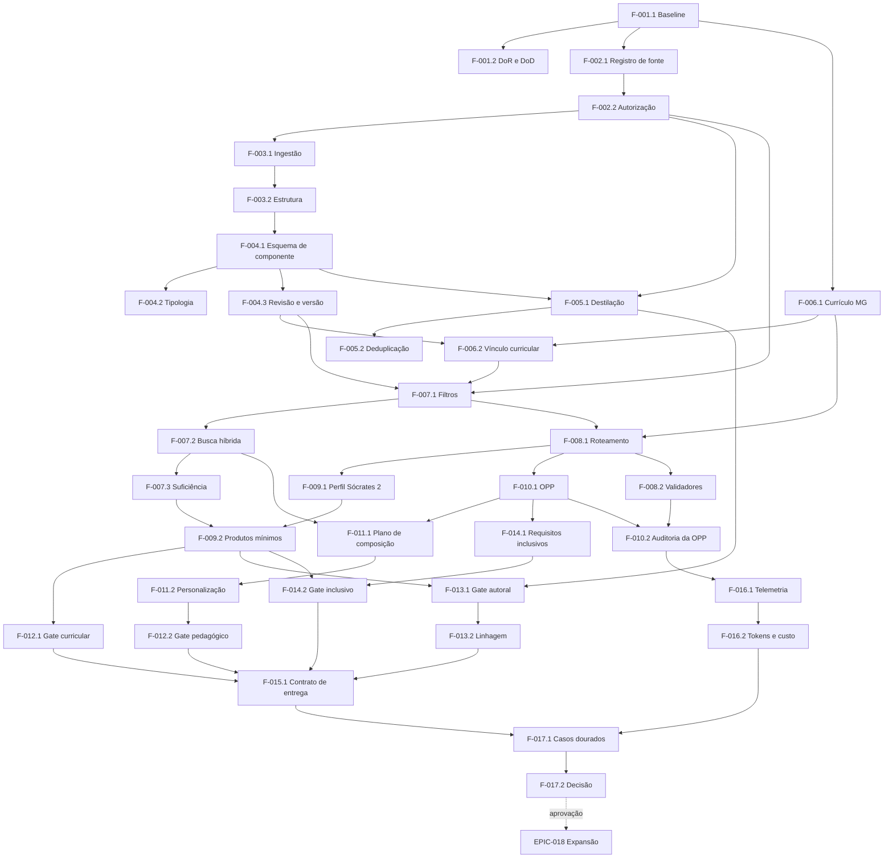

# Mapa de dependências — MVP Sócrates 2

## Objetivo

Organizar a ordem lógica de execução e impedir que o Codex implemente geração, busca ou agentes antes das capacidades que garantem segurança, currículo e rastreabilidade.

## Cadeia crítica

## Ondas recomendadas

### Onda 0 — Contratos e governança

- F-001.1;
- F-001.2;
- contratos documentais das fontes, componentes, currículo, OPP e entrega.

**Saída:** backlog implementável sem lacunas conceituais.

### Onda 1 — Fontes e componentes

- F-002.1 e F-002.2;
- F-003.1 e F-003.2;
- F-004.1, F-004.2 e F-004.3;
- F-005.1 e F-005.2.

**Saída:** pequeno estoque revisado, autorizado e rastreável.

### Onda 2 — Currículo e recuperação

- F-006.1 e F-006.2;
- F-007.1, F-007.2 e F-007.3.

**Saída:** recuperação restrita, híbrida e capaz de reconhecer insuficiência.

### Onda 3 — Roteamento, agente e OPP

- F-008.1;
- F-009.1;
- F-010.1;
- F-008.2;
- F-010.2.

**Saída:** pedido válido convertido em fluxo auditável do Sócrates 2.

### Onda 4 — Produção

- F-009.2;
- F-011.1;
- F-011.2.

**Saída:** quatro produtos mínimos geráveis com personalização básica.

### Onda 5 — Gates e contrato

- F-012.1 e F-012.2;
- F-013.1 e F-013.2;
- F-014.1 e F-014.2;
- F-015.1.

**Saída:** produto validado, rastreável e entregue em contrato estruturado.

### Onda 6 — Evidência e decisão

- F-016.1 e F-016.2;
- F-017.1 e F-017.2.

**Saída:** comparação com baseline e decisão formal.

### Onda opcional — Should

- F-009.3;
- F-011.3;
- F-012.3;
- F-015.2.

Somente após estabilidade das Must correspondentes.

## Bloqueios explícitos

- não implementar busca vetorial antes dos filtros obrigatórios;
- não publicar componentes antes de revisão e autorização;
- não gerar produtos antes de roteamento e OPP válidos;
- não entregar produto aprovado sem os gates Must;
- não comparar custos sem telemetria identificável;
- não iniciar RS ou novos agentes antes da US-017.2;
- não usar interface visual como substituta de contratos e critérios de aceite.

## Dependências externas ainda não fechadas

- fontes exatas juridicamente utilizáveis;
- versão oficial do recorte curricular MG;
- professores avaliadores;
- modelo ou modelos usados no benchmark;
- preços usados para cálculo de custo;
- limiares experimentais de relevância e similaridade.

Essas dependências devem estar resolvidas na Story que as utilizar, conforme a Definition of Ready.
