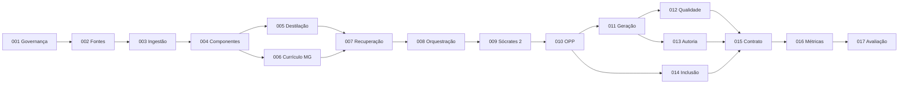

# Seleção formal de Epics do MVP — Sócrates 2

## Objetivo

Definir quais Epics do mapa geral participam do MVP do agente Sócrates 2 e em qual extensão. A seleção preserva o princípio de validar um fluxo completo de ponta a ponta, sem antecipar expansão nacional, novos agentes ou automações industriais.

## Regra de seleção

Um Epic integra o MVP quando sua ausência impedir pelo menos uma destas capacidades:

- utilizar somente fontes autorizadas e rastreáveis;
- transformar fontes em componentes pedagógicos semielaborados;
- aplicar o currículo de Minas Gerais sem carregar ou misturar outros Estados;
- recuperar poucos componentes pertinentes;
- produzir um dos quatro produtos mínimos;
- validar qualidade, autoria, inclusão, custo ou funcionamento do piloto;
- comparar Sócrates 2 com um agente genérico.

## Epics selecionados

### Fundação obrigatória

| Epic | Nome | Papel no MVP | Escopo aprovado |
|---|---|---|---|
| EPIC-001 | Governança e fundação arquitetônica | Pré-condição | Documentação, decisões, DoR, DoD e governança de mudanças |
| EPIC-002 | Governança das fontes e direitos de uso | Controle de entrada | Cadastro, procedência, licença, autorização e bloqueio |
| EPIC-003 | Ingestão e leitura estrutural | Preparação assistida | Pequeno conjunto piloto, extração assistida e revisão humana |
| EPIC-004 | Componentes pedagógicos semielaborados | Núcleo do conhecimento | Tipos, metadados, versões, vínculos, status e campos recuperáveis |
| EPIC-005 | Destilação e deduplicação | Autoria da matéria-prima | Síntese autoral, consolidação, duplicidade básica e unidade canônica |
| EPIC-006 | Pacotes curriculares plugáveis | Contexto curricular | BNCC aplicável e pacote MG para Filosofia do 2º ano |

### Produção especializada

| Epic | Nome | Papel no MVP | Escopo aprovado |
|---|---|---|---|
| EPIC-007 | Almoxarifado inteligente e busca híbrida | Recuperação | Filtros obrigatórios, busca textual e vetorial, fusão simples e fallback |
| EPIC-008 | Orquestração multiagente | Roteamento | Encaminhamento para Sócrates 2, validadores lógicos e registro do fluxo |
| EPIC-009 | Agente piloto Sócrates 2 | Produção principal | Filosofia, 2º ano, MG, quatro produtos mínimos e limites explícitos |
| EPIC-010 | Ordem de Produção Pedagógica | Controle do processo | Pedido, contexto, etapas, componentes, validações e versão do produto |
| EPIC-011 | Geração autoral e personalização | Composição | Planejamento, síntese multifonte, duração, turma, metodologia e variação |

### Gates obrigatórios

| Epic | Nome | Papel no MVP | Escopo aprovado |
|---|---|---|---|
| EPIC-012 | Qualidade pedagógica, curricular e factual | Gate de qualidade | Currículo, conceito, coerência, tempo, clareza e adequação escolar |
| EPIC-013 | Guardião autoral e rastreabilidade | Gate autoral | Similaridade lexical básica, fontes utilizadas, bloqueio e regeneração |
| EPIC-014 | Inclusão e acessibilidade | Gate inclusivo mínimo | Linguagem clara, instruções segmentadas, alternativas e requisitos na OPP |
| EPIC-015 | Contrato de entrega e Gráfica | Saída estruturada | Contrato de entrega; sem diagramação avançada, PDF ou PPTX sofisticado |

### Medição e decisão

| Epic | Nome | Papel no MVP | Escopo aprovado |
|---|---|---|---|
| EPIC-016 | Observabilidade, tokens, custo e latência | Evidência operacional | Métricas por etapa, falhas, componentes recuperados, tokens, custo e duração |
| EPIC-017 | Avaliação do piloto | Decisão do produto | Casos dourados, baseline genérico, avaliação docente e decisão de continuidade |

## Epic excluído do MVP

| Epic | Nome | Classificação | Justificativa |
|---|---|---|---|
| EPIC-018 | Expansão para RS e novos agentes | Won't no MVP | Depende da validação formal do piloto; iniciar antes ocultaria falhas do modelo-base |

## Limites internos dos Epics selecionados

A inclusão de um Epic não significa executar todas as capacidades previstas para fases futuras.

### Permanecem fora do MVP

- currículo do Rio Grande do Sul em produção;
- outros componentes, anos ou agentes;
- ingestão massiva de livros;
- OCR industrial;
- interpretação multimodal completa;
- reranqueamento avançado;
- cache distribuído;
- publicação automática sem revisão;
- análise autoral semântica avançada;
- PDI completo;
- Gráfica avançada;
- PDF e PPTX sofisticados;
- produção em lote;
- painéis operacionais completos;
- decisões pedagógicas autônomas sem supervisão humana.

## Dependência macro

## Critério de conclusão desta seleção

A seleção estará aprovada quando:

1. nenhum Epic necessário ao fluxo completo estiver ausente;
2. nenhum Epic de expansão estiver disfarçado como requisito do piloto;
3. cada Epic selecionado tiver Features, Stories e critérios de aceite;
4. as dependências impedirem implementação em ordem incoerente;
5. a expansão do EPIC-018 permanecer bloqueada até a decisão do EPIC-017.
