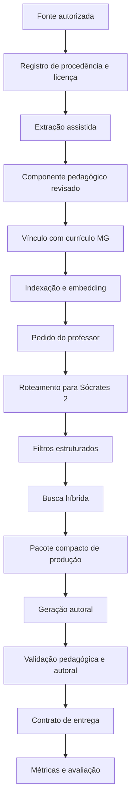

# MVP Sócrates 2

## Propósito

Validar, em pequena escala e de ponta a ponta, se a arquitetura da ProfePlan Knowledge Factory consegue transformar fontes autorizadas e currículos em materiais pedagógicos autorais, rastreáveis, rápidos e adequados ao professor.

O MVP não pretende cobrir toda a plataforma, todas as disciplinas ou todo o acervo PNLD.

## Escopo educacional

- componente: Filosofia;
- etapa: Ensino Médio;
- ano: 2º ano;
- agente principal: Sócrates 2;
- currículo estadual principal: Minas Gerais;
- currículo nacional: BNCC aplicável;
- público de validação: professores de Filosofia do Ensino Médio.

## Hipótese principal

Um agente especializado por componente, etapa e ano, acessando somente componentes pedagógicos autorizados e filtrados antes da busca vetorial, produzirá materiais mais pertinentes e com menor ruído de contexto do que uma geração baseada em pesquisa global e agente genérico.

## Perguntas que o MVP precisa responder

1. O isolamento por componente, etapa e ano reduz recuperações inadequadas?
2. Os componentes semielaborados permitem criatividade sem exigir capítulos inteiros no prompt?
3. O pacote curricular de Minas Gerais orienta a geração sem precisar ser carregado integralmente?
4. A resposta final é pedagogicamente superior a uma geração genérica equivalente?
5. A rastreabilidade é suficiente para auditoria?
6. O controle autoral evita reprodução extensa das fontes?
7. O custo e a latência são aceitáveis para um SaaS docente?
8. A infraestrutura pode receber posteriormente o currículo do Rio Grande do Sul sem duplicar o agente?

## Fluxo mínimo completo

## Fontes do piloto

O piloto deverá utilizar apenas um conjunto pequeno e juridicamente classificado.

### Quantidade inicial recomendada

- 1 pacote curricular BNCC;
- 1 pacote curricular de Minas Gerais;
- 1 a 2 fontes filosóficas ou didáticas autorizadas;
- materiais próprios da WR Tech ou do responsável pedagógico;
- 1 conjunto de exemplos de bons materiais produzidos por professores.

### Regra

Nenhuma fonte poderá ser utilizada na geração se não possuir:

- identificação;
- procedência;
- versão;
- classificação de licença;
- finalidade permitida;
- status de validação.

## Estoque inicial de componentes

O MVP não precisa de milhares de registros.

### Meta recomendada

Entre 100 e 300 componentes revisados, distribuídos entre:

- conceitos filosóficos;
- problemas filosóficos;
- contextualizações;
- estratégias metodológicas;
- atividades-base;
- avaliações formativas;
- orientações inclusivas.

A quantidade exata deverá ser ajustada pela cobertura temática, e não usada como métrica isolada de sucesso.

## Temas recomendados para o piloto

O conjunto deverá cobrir temas suficientemente diversos para testar recuperação e autoria. Sugestão inicial:

- ética e moral;
- liberdade e responsabilidade;
- conhecimento, verdade e opinião;
- política, poder e cidadania;
- ciência e senso comum;
- Filosofia e Cristianismo: fé e razão;
- identidade, existência e projeto de vida;
- tecnologia, ética e sociedade.

## Produtos mínimos

O Sócrates 2 deverá produzir, no mínimo:

1. plano de aula;
2. texto didático autoral;
3. atividade reflexiva;
4. avaliação formativa curta.

Esses produtos podem ser solicitados isoladamente ou como um pequeno pacote de aula.

## Entradas mínimas do professor

- componente curricular;
- etapa;
- ano;
- currículo ativo;
- tema;
- tipo de produto;
- duração;
- nível ou perfil da turma;
- metodologia desejada, quando houver;
- necessidade inclusiva, quando houver.

O cadastro do professor poderá preencher automaticamente componente, Estado e preferências, mas o MVP deve permitir verificação explícita desses valores.

## Perfil do Sócrates 2

### Acesso obrigatório

- Filosofia;
- Ensino Médio;
- 2º ano;
- pacote curricular MG vigente;
- componentes aprovados;
- fontes autorizadas para geração;
- regras de qualidade e autoria.

### Acesso complementar

Somente quando necessário e solicitado pelo fluxo:

- contextualização histórica;
- relação com Sociologia, Literatura ou outras áreas;
- orientação inclusiva;
- validação factual.

### Acesso bloqueado por padrão

- outros componentes curriculares;
- Ensino Fundamental;
- 1º e 3º anos do Ensino Médio;
- currículo do Rio Grande do Sul;
- fontes sem autorização;
- componentes em rascunho ou reprovados.

## Estratégia de recuperação do MVP

### Etapa 1 — filtros obrigatórios

- componente = Filosofia;
- etapa = Ensino Médio;
- ano = 2º;
- currículo = MG;
- status = aprovado;
- geração permitida = verdadeiro;
- tipo de componente compatível com o produto.

### Etapa 2 — busca

- busca textual;
- busca vetorial;
- fusão simples de resultados;
- seleção dos componentes mais relevantes.

### Etapa 3 — pacote de produção

O agente final não deverá receber todos os candidatos. Receberá um pacote compacto com:

- habilidade ou objetivo curricular;
- conceitos prioritários;
- problema filosófico;
- estratégia metodológica;
- possibilidade avaliativa;
- requisito inclusivo;
- referências internas.

## Orçamento inicial de contexto

Os valores abaixo são hipóteses de partida e deverão ser medidos:

- até 8 componentes principais recuperados;
- até 2 evidências de fonte adicionais, somente se necessárias;
- preferência por resumos estruturados;
- proibição de capítulos completos no contexto de geração;
- orçamento separado para recuperação, geração e validação;
- interrupção ou fallback se o acervo não possuir base suficiente.

O limite exato de tokens será definido após benchmark e não deverá ser fixado apenas por estimativa documental.

## Qualidade mínima

Cada produto deverá ser verificado quanto a:

- aderência ao pedido;
- alinhamento ao currículo ativo;
- correção conceitual;
- coerência entre objetivo, atividade e avaliação;
- adequação ao 2º ano;
- viabilidade no tempo indicado;
- clareza das instruções;
- autoria;
- rastreabilidade;
- atendimento dos requisitos inclusivos informados.

## Critérios de sucesso

Os valores numéricos finais serão definidos na estratégia de testes, mas o MVP deverá demonstrar:

- ausência de mistura indevida entre disciplinas, anos e Estados nos casos de teste;
- recuperação de poucos componentes relevantes;
- materiais avaliados como pedagogicamente utilizáveis por professores;
- respostas autorais, sem reprodução extensa das fontes;
- rastreabilidade de todos os componentes utilizados;
- custo e latência mensuráveis;
- estabilidade suficiente para repetir o fluxo;
- possibilidade comprovada de conectar futuramente outro pacote estadual ao mesmo agente.

## Baseline obrigatório

A avaliação deverá comparar o Sócrates 2 com uma abordagem genérica:

- mesmo pedido;
- mesmo modelo de geração, quando possível;
- agente genérico sem isolamento de conhecimento;
- busca ampla ou sem filtros especializados;
- comparação de qualidade, tokens, latência e erros de recuperação.

Sem baseline, não será possível provar que a complexidade da arquitetura especializada entrega benefício real.

## Fora do escopo do MVP

- currículo do Rio Grande do Sul em produção;
- Filosofia do 1º e 3º anos;
- demais componentes curriculares;
- todos os módulos do ProfePlan;
- geração completa de planejamento anual;
- PDI completo;
- ingestão industrial de dezenas de livros;
- processamento multimodal avançado de todas as imagens;
- Gráfica avançada com PDF, PPTX e múltiplos temas;
- publicação automática sem revisão;
- acordos comerciais com editoras;
- expansão para todos os Estados.

## Gráfica no MVP

O MVP não implementará a Gráfica completa.

Entregará um contrato estruturado contendo:

- título;
- identificação do produto;
- conteúdo do professor;
- conteúdo do estudante;
- atividades;
- avaliação;
- referências internas;
- requisitos visuais e de acessibilidade;
- formatos desejados.

Isso permite validar a fábrica pedagógica sem misturar o resultado com problemas de diagramação e exportação.

## Dependências para iniciar implementação

Antes de enviar ao Codex, deverão estar aprovados:

- mapa de Epics;
- este escopo de MVP;
- modelo dos componentes;
- padrão do pacote curricular;
- contrato da Ordem de Produção Pedagógica;
- regras mínimas de fontes e autoria;
- Features e Stories do MVP;
- critérios de aceite;
- Definition of Ready;
- Definition of Done.

## Critérios de encerramento do MVP

O MVP será encerrado somente quando:

1. o fluxo completo funcionar de ponta a ponta;
2. os casos dourados forem executados;
3. professores avaliarem amostras;
4. tokens, custo e latência estiverem documentados;
5. falhas e limitações estiverem registradas;
6. houver decisão formal de avançar, ajustar ou interromper;
7. a expansão para RS e novos agentes não tiver sido iniciada antes da decisão.

## Decisões humanas ainda necessárias

- aprovação dos temas iniciais do piloto;
- definição das fontes juridicamente utilizáveis;
- aceitação da meta inicial de 100 a 300 componentes;
- confirmação dos quatro produtos mínimos;
- aprovação de que a Gráfica avançada ficará fora do MVP;
- seleção dos professores que participarão da avaliação.
